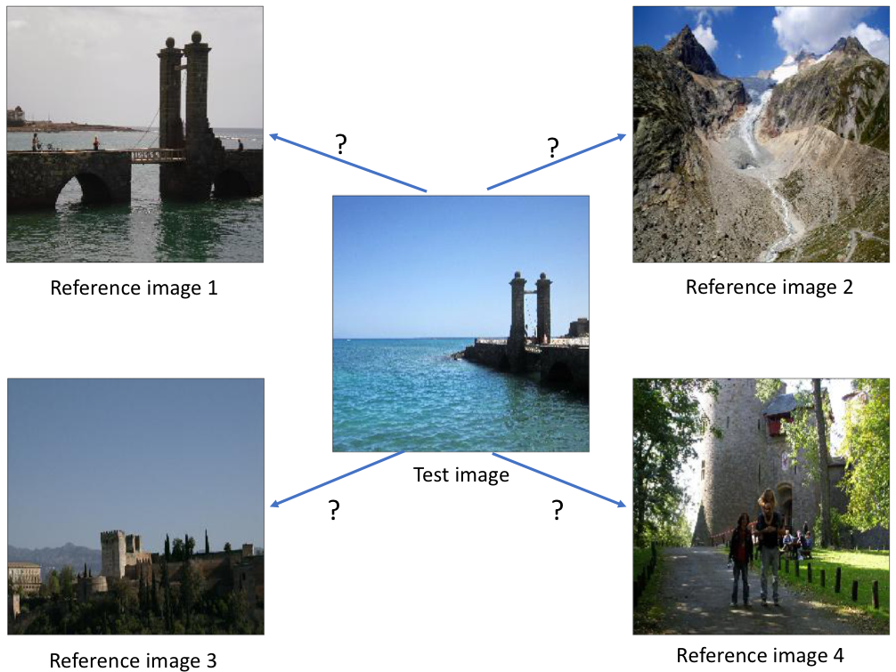
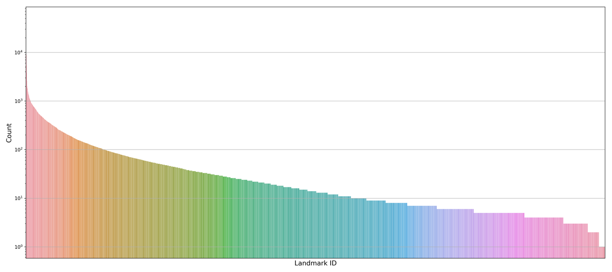
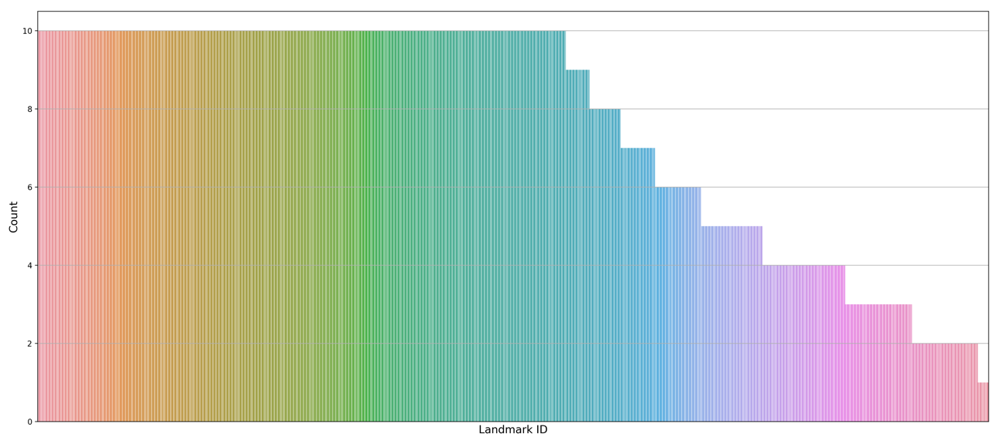
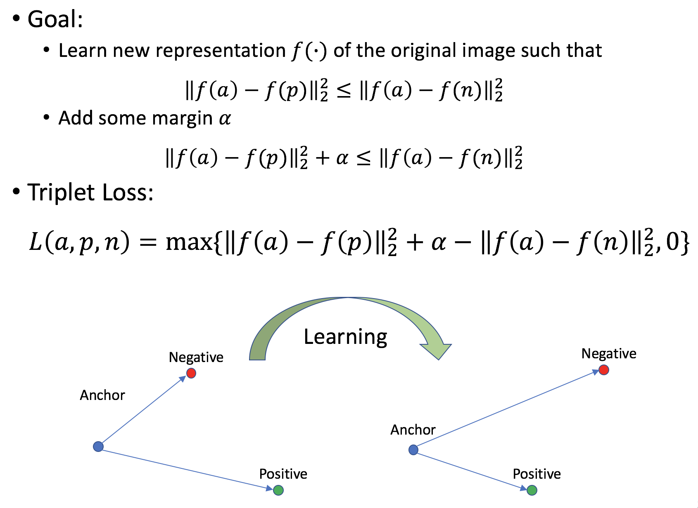
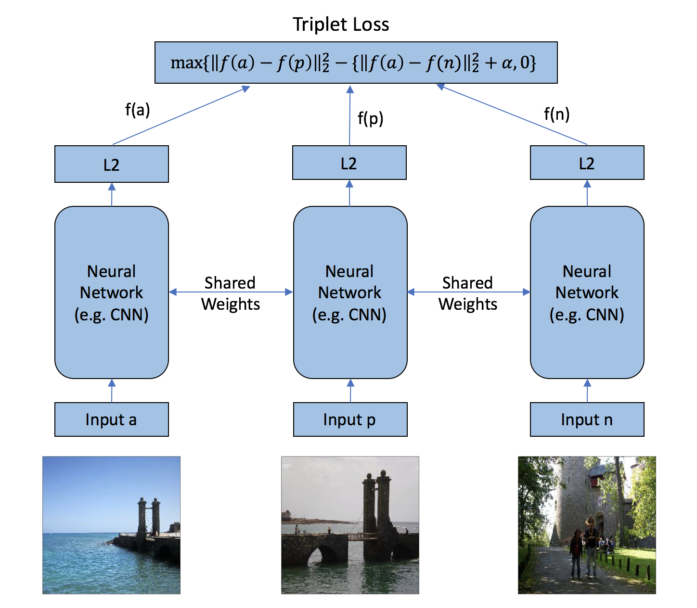
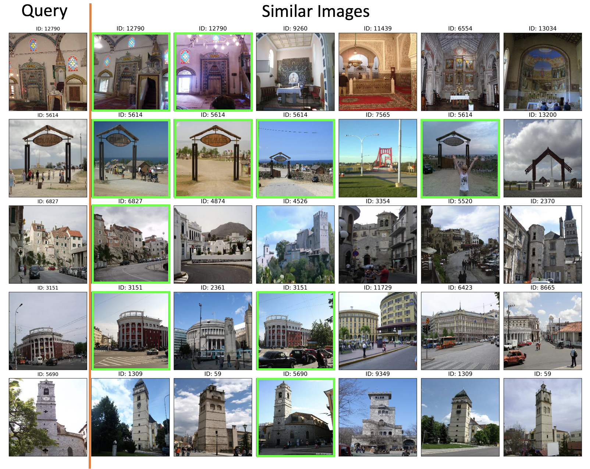

# Landmark_Recognition

* Question: Given a photo, can we recognize the correct landmarks it contains?

## One-shot learning
An object categorization problem in computer vision. Whereas most machine learning based object categorization algorithms require training on hundreds or thousands of images and very large datasets, one-shot learning aims to learn information about object categories from one, or only a few, training images.

### Characteristics:
* A few training images for each object/class
* Potentially large amount of objects/classes

### Application
* Face/Item Recognition/Verification
* Street-to-Shop Systems
* Landmark Recognition

## Landmark Recognition

### Datasets
* Google Landmark Recognition Dataset
    - 1,225,029 training images with 14,951 landmarks
    - 117,703 test images
    - Image aren't evenly distributed

* Subset Dataset for this work
    - 113,783 training images with 14,943 different landmarks
    - 22,255 validation images with 7675 different landmarks
    - 22,391 test images with 14436 different landmarks

### Metric Learning

### Triplet Network

* Fine-tuning with pre-trained models
    - VGG16, InceptionV3, and ResNet have been well trained
    - Lower layers usually encode more generic, reusable features
    - Higher layers encode more specialized features
    - Freeze lower layers and only train the top several layers

### Prediction

### Results
* With fine-tuned InceptionV3 Triplet Network, top 1 accuracy is 47%

